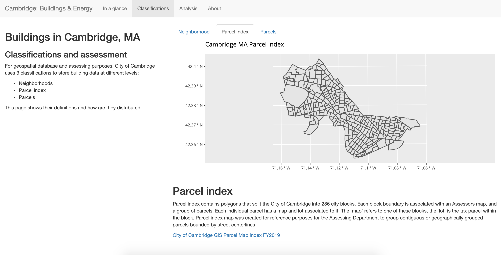

```{r setup, include=FALSE}
knitr::opts_chunk$set(echo = FALSE)
```

## Overview

Globally, buildings & constructions accounts for 28% total carbon emissions globally, while the energy demand is expected to keep growing. These demand are mostly coming from cities where many people live and work to power up their buildings. With the increasing public concern and media coverage in climate change and sustainability, cities are starting to tackle climate change by creating climate action plans. One of the initiatives is increasing data transparency in energy sector. 

As part of their Net Zero Action Plan, City of Cambridge released a disclosure ordinance for buildings energy use. The Building Energy Use Disclosure Ordinance (BEUDO) was enacted by the Cambridge City Council on July 28, 2014. The ordinance is a key step in efforts to reduce Cambridge's greenhouse gas (GHG) emissions. This project aims to examine the data using visualization techniques to better understand the data.

## Energy use in Cambridge

Energy use in buildings accounts for about 80% of GHG emissions in Cambridge, with two-thirds of the total related to commercial, institutional, and large multifamily buildings. Efforts to improve the energy performance of our building stock is hampered by the invisible nature of energy use.

## Cambridge Building Disclosure Ordinance

The ordinance is intended to address this problem by requiring owners of larger buildings to track and report annual energy use to the City and publicly disclose the data. Disclosure places the information in the marketplace, where various users such as potential property buyers, tenants, realtors, energy service providers, and others can use the data and to help create value for higher energy performing properties. The data will also aid the City and others in planning for higher energy performance in our building stock.

## Development

We present a visualization tool to help people explore the data visually. The tool was developed in R and Shiny using the Cambridge Building Energy and Water Use Data Disclosure 2016-2018 retrieved from Cambridge Open Data Portal.

## Architecture

```{r, echo=FALSE, fig.cap="Page one", out.width = '100%'}


```

Page one aims to visualize the overview of Cambridge buildings and energy use. Histogram of Cambridge buildings are shown with custom slider where the user can filter the data based on year built and granularity. The second element is showing a treemap of which building type consumes more electricity relatives to the other ones.

```{r, echo=FALSE, fig.cap="Page Two", out.width = '100%'}

```

Page two aims to educate the user about parcels and indexes - a breakdown on how the data is stored by the municipality. 

```{r, echo=FALSE, fig.cap="Page Two", out.width = '100%'}

```

Page three aims to visualize the data from page one spatially. Users can change between water, energy, and carbon emissions by parcel index.

## References

Cambridge Buildings and Energy Disclosure Ordinance. Retrieved from (https://www.cambridgema.gov/CDD/zoninganddevelopment/sustainablebldgs/buildingenergydisclosureordinance.aspx)

Cambridge Building Energy and Water Use Data Disclosure 2016-2018 [CSV File]. Retrieved from Cambridge Open Data Portal (https://data.cambridgema.gov/Energy-and-the-Environment/Cambridge-Building-Energy-and-Water-Use-Data-Discl/72g6-j7aq)